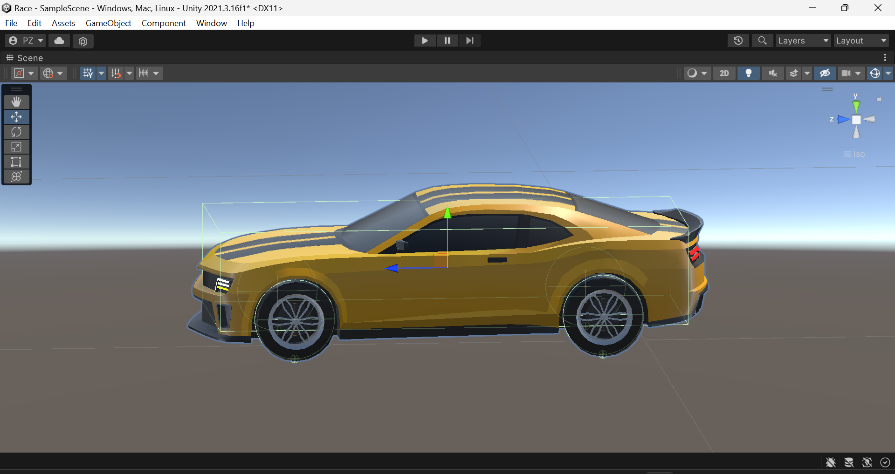
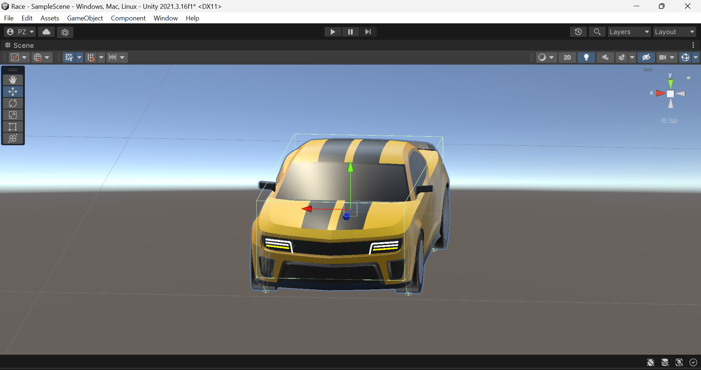
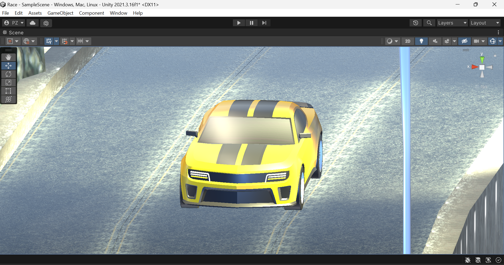
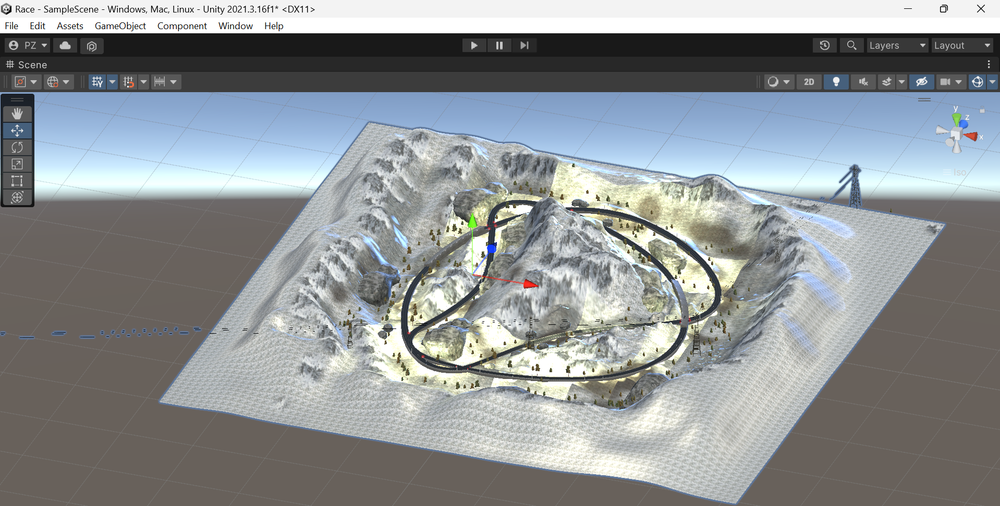
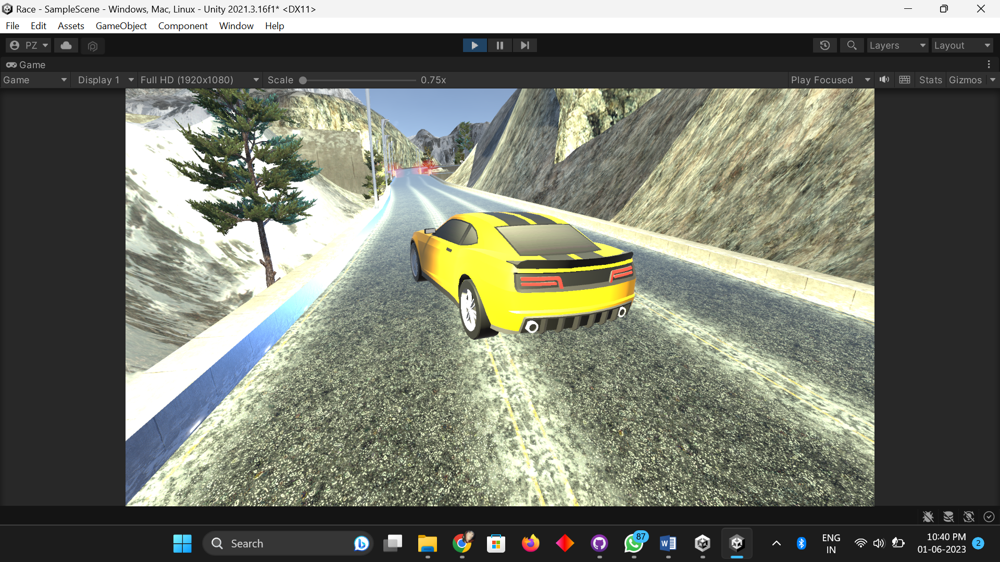

# RacingGame

My basic build of a racing game which I build using Unity 3D.

For the credits I have used the car model from [here](https://assetstore.unity.com/packages/3d/vehicles/land/arcade-free-racing-car-161085).

The track model from [here](https://assetstore.unity.com/packages/3d/environments/roadways/mountain-race-track-night-68199).

The car is controlled using W,A,S,D or arrows.

# Pictures

